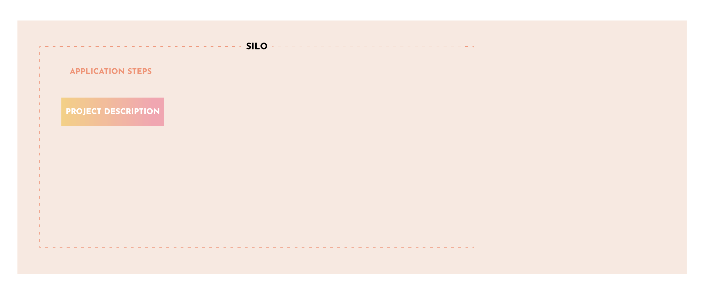

# Step 1: A New Project Proposal

## Propose Your Project (Temperature Check)

Welcome! The first step on your journey is to publicly announce the project that you would like to work on or create. This step lets you get a sense of how your project will be received by the Yam Community. There is no vote at this stage of the process.

Post your Application to the [Yam Forum](https://forum.yam.finance/) in the Grant/Silo Proposals section so the Yam community can review and discuss your proposal idea directly with you.

View the application form [here](/siloDocs/Template/silo-app-template.md) and clone/copy it from Github [here](https://github.com/rossgalloway/YAM-Project-Silos/blob/master/Template/silo-app-template.md)

## Project Application Assistance

If you need help, pop into the discord and the Gov-Ops Council or other community members can assist you with the application and help to ensure its completeness. Gov-Ops Council members are elected facilitators who make recommendations based on a set of pre-defined criteria. Their goal is to help clarify a project's value and scope and align interests between the Grant applicant and Yam token holders.

Once you have posted your new project proposal, it is time to start on step 2: The Specification Document.
