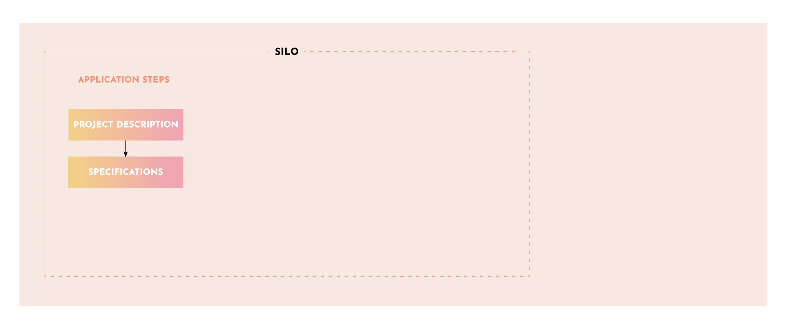

# Step 2: Specifications Document

## Create a Specification Document

Before you can submit a grant proposal to work on your project, you need to specify what you intend to build so that Yam Token holders can decide whether it is a project that they want to fund and understand the amount of work that will go into it. Because grants are contracts between YAM token holders and the contributor working on the project, understanding what the grant is paying for is crucial. The Project Specification Document (Spec) must be thorough and include as much information as possible for Token Holders to later determine whether the work promised matches the work done.

You can create a specifications document either from the provided template or from your own format (We recommend the template if you don't have experience with documents like these, but feel free to tweak as needed). Gov-Ops can provide assistance as needed. If your project requires more extensive requirements and research, you can build a specifications definition phase into your grant proposal (Step 3) and make it the first paid phase of your project. If you take this path, you should still create and post a preliminary specifications document that you intend to expand upon.

View the specifications document template [here](siloDocs\Template\silo-specification-template.md) and clone/copy it from Github [here](https://github.com/rossgalloway/YAM-Project-Silos/blob/master/Template/silo-specification-template.md)

You can contact Gov-Ops Council Members on the Yam Discord if you have general questions about the Specifications documentation.

## Post the Specifications Document

When it is ready, Post your Specifications Document to the Grant/Silo Proposals section of the [Yam Forum](https://forum.yam.finance/) for review. Upon doing so, it is likely a discussion will take place between you, the Yam community and Yam token holders. This type of interaction and discussion with the Yam community is an important step for building support and consensus for Step 3 when you submit your Grant proposal.

## Review The Specifications Document

The Gov-Ops Council reviews documentation for completeness. Gov-Ops can also assist applicants in understanding what details are needed and how to best communicate them. It may also help applicants target their requirements in a way that is most likely to answer Yam token holders questions so that they can make an informed decision when voting. This review is important because the quality of these documents determines the success of the Grants program.

Once the specification document is posted, Yam token holders can review and ask additional questions or ask for more clarification. The Applicant can choose to modify their document per the comments or leave it as is and move to the voting phase.

Once the document is complete, a snapshot vote is required to approve the Project Specification and move to Grant Proposal phase. Yam token holders will vote YES if they see merit and value of the work or project based on your Specifications document, Silo Application and discussions.
