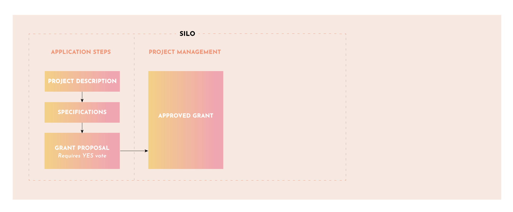

# Step 3: Submit a Grant Proposal

Now it’s time to create a Grant Proposal which will reference the project description and specification documents from steps 1 and 2. You can use the Grant Proposal form provided below as a guide for including a clear definition of deliverables, time frames, phases, payment milestones, etc.

Post your Grant Proposal to the Yam Forum, giving the Yam community on last look before it goes up for vote. Finally post it to the [Yam Snapshot](https://snapshot.org/#/yam.eth) voting site for approval. If token holders vote ‘Yes’ and it passes quorum the result is a fully approved project Silo funded with an approved Yam Grant that will serve as a contract between the Silo team and Yam DAO. Congratulations, you (and your team) are ready to get to work.

### Gov-Ops checks Grant Applications for accuracy and effectiveness

When someone fills out a Yam Grant application, it is reviewed by Gov-Ops members for accuracy. The Gov-Ops council members are not making decisions on the value of the application, rather, they are facilitators that help grant applicants follow the proper processes as well as to assist them with how to best craft their proposal for acceptance by the Yam token holders.

### Yam token holders review Grant Proposal

If a project is very simple, it may be able to go straight to the token holders for voting. However, most projects will be more complex and token holders may ask questions for a period or time, and or, ask for a requirements document to be created if one has not yet. The quality of interactions between the Grant proposer and the Yam community helps foster win-win outcomes.

### Grant application is modified if needed

Grant applicants have the ability to address token holders questions directly and canvass support for their Grant. As such, the Grant Proposal may need to be modified by the applicant along with the supporting documents such as requirements, site map or other items that help convince token holders of the Grants value.

### Vote to approve Grant

Once the Grant Proposal is ready, you will work with Gov-Ops who is can prepare the Grant for the Yam token holder vote. Good luck!
