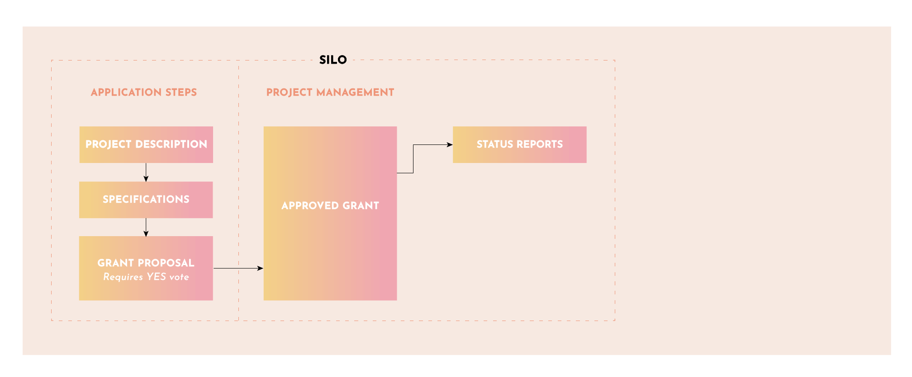

# Step 4: Work Begins!

Once your Grant is approved, you and your project team control all aspects of your project. As a contractor, you have the freedom to run your project as you wish. You are however bound by the terms of the approved Grant which stipulates periodic check points to assure accountability and so that Yam token holders can make sure the project is on track. This is accomplished via monthly Status Reports posted to the Yam Forum, outlining your projects status and any challenges or issues that may have arisen. Silo teams manage their own projects while the Yam community is able to monitor your project and its use of treasury funds.

### Gov-Ops Assures Projects are in Compliance

Gov-Ops members assist Silo teams to stay in compliance throughout the Yam Grants process. This may include coordinating project changes or disputes. In certain cases, Gov-Ops may escalate an issue to token holders for a vote for resolution.

### Silo teams can respond to issues and or request changes

There are tools and processes in place to handle issues and changes to the scope of work, project requirements and or the Grant itself. Silo teams can ask Gov-Ops for assistance with these processes

### Yam Token Holders vote on issues if needed

In the rare case that an issue needs to be escalated, it may have to be voted on by token holders. But only after a thorough discussion (and negotiation if needed) on how to best resolve the issue.
