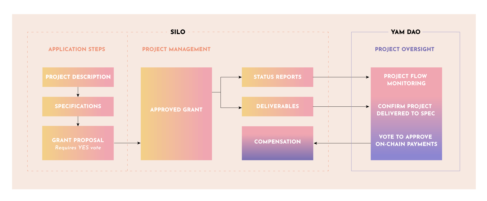

# Step 5: Deliver the Work and Request Payment

While project teams have full control of their projects, Silo teams must deliver the work as defined by the terms of the Yam Grant which serves as a contractual agreement.  Based on the terms of the Grant, you’ll either submit payment requests upon delivery of the job, or on a pre-defined cadence such as monthly payments, or by the completion of project phases. Payments are made by the Gov-Ops Council via an approved on-chain vote by Yam token holders. Accountability is achieved because both parties are incentivized to deliver on their side of the bargain.

### Project teams submit Status Reports for payment

A Status Report template is provided which is completed and posted in the Contributor Compensation area within the Yam Forum. If there are questions or disputes, the payment will be included in the next round of monthly on-chain proposals. If multiple payments are part of your Grant, a separate Status Report will be needed for each.

### Yam community members monitor deliverables and verify completion

Yam token holders and Gov-Ops will monitor and verify the accuracy, timeliness and completion of the Silo teams deliverables. Gov-Ops may help negotiate a reasonable solutions if there are disagreements.

### Gov-Ops consults with Silo teams on questions

Gov-Ops and Governance Stewards reviews Status Reports and verify accuracy. If there is a discrepancy or question, the Gov-Ops members will attempt to resolve it with the Silo team. Otherwise it will be allowed to receive comments from the Yam Community on the Yam Forum until resolved.

Silo teams do the best they can at specifying and estimating work tasks and deliverables. Yet sometimes unforeseen changes or some other kind of challenge occurs. In such cases the Silo team should be proactive, offering alternatives, create a new proposal or submit a change order if needed.

Token holders vote to approve payments based on the compensation requests in the Silo Status Reports. Payment is executed via an on-chain vote which sends the payment directly to the recipients wallet in approximately five business days. (A single compensation request, or multiple requests may be bundled into an on-chain proposal.) If there is a payment issue that needs to be resolved token holders will vote with the incentive to resolve the issue in a way that is fair as to keep the system in balance.
