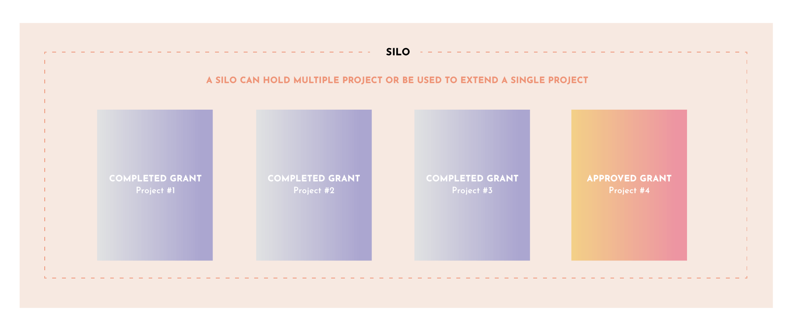

# Step 6 - How to Extend or Renew Your Project

Some projects are finite and come to completion when the project or work is delivered and the Grant has been fully paid. Other projects or work may follow different trajectories. The Silo/Grant based system is open and flexible enough to allow for variations on how projects can be organized and performed.

For instance a project can be setup as ongoing. Or an existing project may be extended by adding another phase, or by lengthening the duration of a project. The flexibility of the Silo structure is helpful as it serves as an overall container in which multiple sub-projects as well as new Grants can be added. Talk with Gov-Ops Council who can help you to determine the best path forward for ongoing and extended work.

